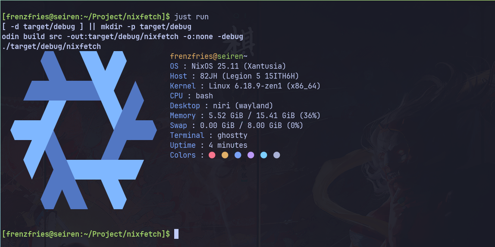
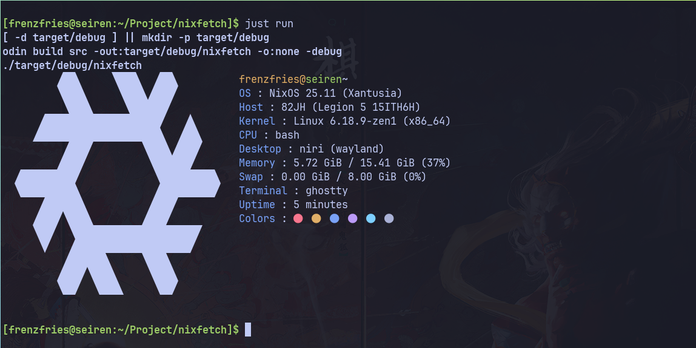

# nixfetch

A fast, minimal system information fetch tool for Linux, written in [Odin](https://odin-lang.org). Displays system info alongside a colored NixOS logo.

## Preview

| Colored | 
| ------- |
|  |


| Black & White |
| ------- |
|  |


## Information Displayed

| Field    | Source                              |
| -------- | ----------------------------------- |
| User     | `$USER` + `uname` syscall          |
| OS       | `/etc/os-release` PRETTY_NAME      |
| Host     | `/sys/devices/virtual/dmi/id/`     |
| Kernel   | `uname` syscall                    |
| Shell    | `$SHELL`                           |
| Desktop  | `$XDG_CURRENT_DESKTOP` / `$XDG_SESSION_TYPE` |
| Memory   | `/proc/meminfo`                    |
| Swap     | `/proc/meminfo`                    |
| Terminal | `$TERM_PROGRAM`                    |
| Uptime   | `sysinfo` syscall                  |
| Colors   | ANSI color palette                 |

## Building

### Prerequisites
- [Odin](https://odin-lang.org) compiler
- [just](https://github.com/casey/just) command runner

If you're on NixOS or have Nix installed, a dev shell is provided:
```sh
nix develop
```

### Build & Run

```sh
# default (debug) build
just build
just run

# optimized builds
just build-speed      # speed optimization
just build-size       # size optimization
just build-aggressive # aggressive optimization
just build-minimal    # minimal optimization

# build and run in one step
just run-speed
```

Binaries are output to `target/<variant>/nixfetch`.

## Project Structure

```
src/
├── main.odin     # entry point, collects system info
├── lib.odin      # system info gathering functions
└── format.odin   # NixOS logo definitions
flake.nix         # Nix dev environment
justfile          # build recipes
```

## License
MIT
