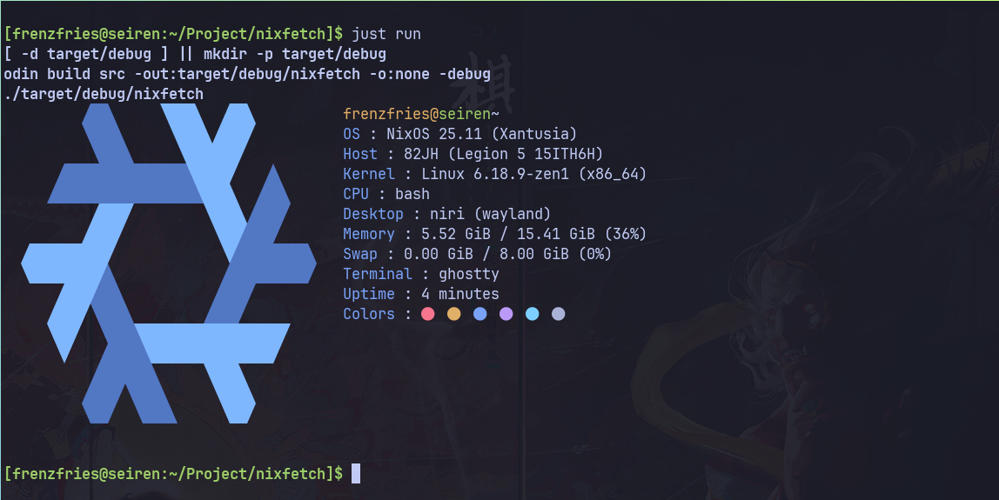
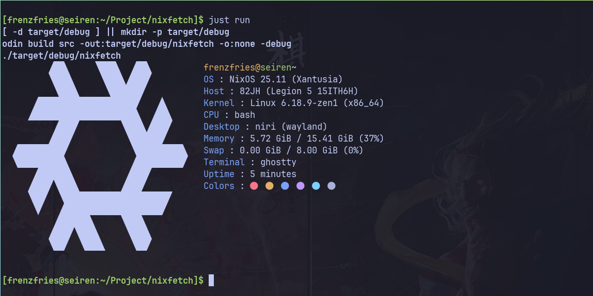
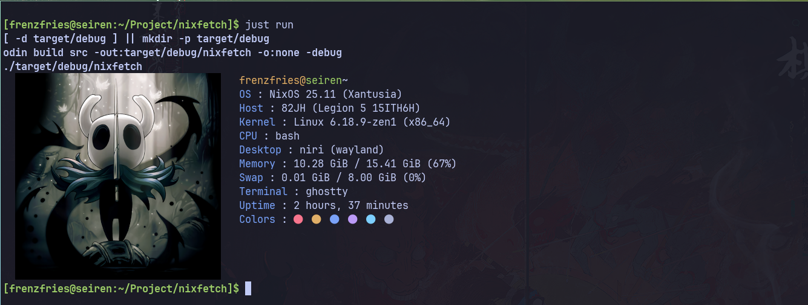
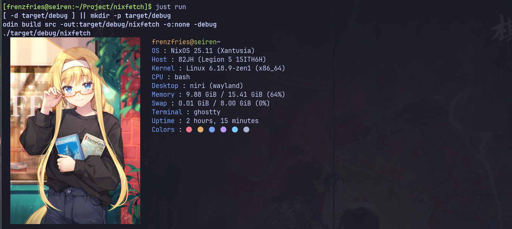
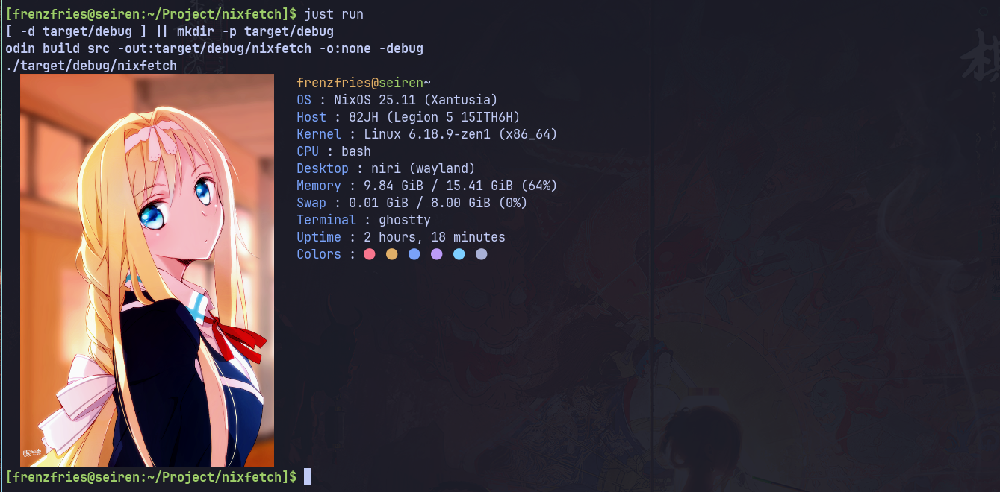

# nixfetch

A fast, minimal system information fetch tool for Linux, written in [Odin](https://odin-lang.org). Displays system info alongside a colored NixOS logo.

## Preview











## Layouts

The layout is picked at build time; each one gathers only the fields it prints.

| Layout    | Look                                                        |
| --------- | ----------------------------------------------------------- |
| `Flurry`  | the default: a short list, `Label : value`, a row of color dots |
| `Frost`   | fastfetch style: `user@host`, a rule, every field, color blocks |
| `Glacier` | fields grouped into System Specs, Software Specs and Session boxes |
| `Icicle`  | short upper-case labels, memory drawn as a bar              |

```sh
odin run build.odin -file -- build -o:speed -layout:Glacier -icons:false
```

With Nix, override the package: `nixfetch.override { layout = "Glacier"; icons = false; }`.
Icons are [Nerd Font](https://www.nerdfonts.com) glyphs, so turn them off without one.

## Custom Image Support

On terminals that support the [Kitty graphics protocol](https://sw.kovidgoyal.net/kitty/graphics-protocol/) (e.g. Ghostty, Kitty), you can display a custom PNG image instead of the ANSI logo by setting the `NIXFETCH_IMAGE` environment variable:

```sh
NIXFETCH_IMAGE=/path/to/image.png nixfetch
```

The image is drawn 55 cells wide, as tall as its aspect ratio needs. When the variable is unset, or does not point at a PNG, nixfetch falls back to the colored NixOS logo.

## Information Displayed

| Field         | Source                                                   |
| ------------- | -------------------------------------------------------- |
| User          | `$USER` + `uname` syscall                                |
| OS            | `/etc/os-release` PRETTY_NAME                            |
| Host          | `/sys/devices/virtual/dmi/id/`                           |
| Kernel        | `uname` syscall                                          |
| Uptime        | `sysinfo` syscall                                        |
| Packages      | `nix-store --query --references` on the system and user profiles, cached in `~/.cache/nixfetch` until a rebuild changes them |
| Shell         | `$SHELL`, version from its nix store path                |
| Display       | `/sys/class/drm/*/edid`                                  |
| Desktop       | `$XDG_CURRENT_DESKTOP` / `$XDG_SESSION_TYPE`             |
| Theme, Icons  | gtk2/3/4 settings files                                  |
| Cursor        | `$XCURSOR_THEME` / `$XCURSOR_SIZE`, else gtk settings    |
| Terminal      | `$TERM_PROGRAM`, `$TERM_PROGRAM_VERSION`, else `$TERM`   |
| Terminal Font | ghostty or kitty config                                  |
| CPU           | `/proc/cpuinfo`, cpufreq sysfs                           |
| GPU           | `/sys/class/drm`, the nvidia driver, `pci.ids`           |
| Memory, Swap  | `/proc/meminfo`                                          |
| Disk          | `statfs("/")`, `/proc/mounts`                            |
| Local IP      | `/proc/net/route`, `SIOCGIFADDR`                         |
| Battery       | `/sys/class/power_supply`                                |
| Locale        | `$LC_ALL`, else `$LANG`                                  |
| OS Age        | birth time of `/`                                        |
| Colors        | ANSI color palette                                       |

## Building

### Prerequisites
- [Odin](https://odin-lang.org) compiler

If you're on NixOS or have Nix installed, a dev shell is provided:
```sh
nix develop
```

### Build & Run

```sh
odin run build.odin -file -- build              # debug build
odin run build.odin -file -- build -o:speed     # optimized build
odin run build.odin -file -- run                # build and run
odin run build.odin -file -- build -help        # every flag
```

Binaries are output to `target/<level>/nixfetch`.

## Project Structure

```
src/
├── main.odin     # entry point, the arena and the single write
├── lib.odin      # compile-time config, icons, System and the field collectors
├── layout.odin   # the four layouts and the logo or image beside them
└── logo.odin     # NixOS logo definitions
build.odin        # build script
flake.nix         # Nix dev environment and package
```

## License
MIT
